# JWT token for API using Flask

# Feature

- JWT authentication
- Throttle limit on some API
- Upload Multiple Image file at same time
- Upload Single/Multiple file using Web Interface
- Server log for uploaded files
- unit test for some function
- Added Curl command documentation for all API
- API for all uploaded Files/ register Users
- hash password for user registration
- Web camera access only on Mobile devices(Android/IOS)


# How to run the Application on Local Server

- run the following command in the terminal

Before running down below command, Download Local serve compatiable files.

Download Link: https://drive.google.com/file/d/1PEYO2ZUHz_u8zPpsPWhsOT1Z55Llk5r2/view?usp=sharing

Above repo is compatiable for herokuapp.

``` 
pip install -r requirements.txt

cd assignment

python main.py

```

# Curl Commands

### Image upload 
```
curl -H "Authorization: Bearer <token>" --output -X POST https://flaskimageupload.herokuapp.com/upload -F files=@1.png
```

### Register User
```
curl -i -H "Content-Type: application/json" -X POST -d "{\"username\":\"<username>\", \"password\":\"<password>\"}" https://flaskimageupload.herokuapp.com/register
```

### User Login 
```
curl -i -H "Content-Type: application/json" -X POST -d "{\"username\":\"<username>\", \"password\":\"<password>\"}" https://flaskimageupload.herokuapp.com/login
```

### User List
```
curl -X GET 'https://flaskimageupload.herokuapp.com/user' -H 'Authorization: Bearer <token>'
```

### Uploaded Image List
```
curl -H "Authorization: Bearer <token>" --output -X GET https://flaskimageupload.herokuapp.com/files
```

# Curl Command Response

For more detailed info about API response reference to ```curl-format.txt``` file.

# Web camera URL

<b> PLease Note that if webcam is not showing up on mobile and you can see ```CLICK A PHOTO``` Button. It means that webapp doesn't have camera permission. You have to update permissions. </b>


```
https://flaskimageupload.herokuapp.com/webcam
```

# Screenshots

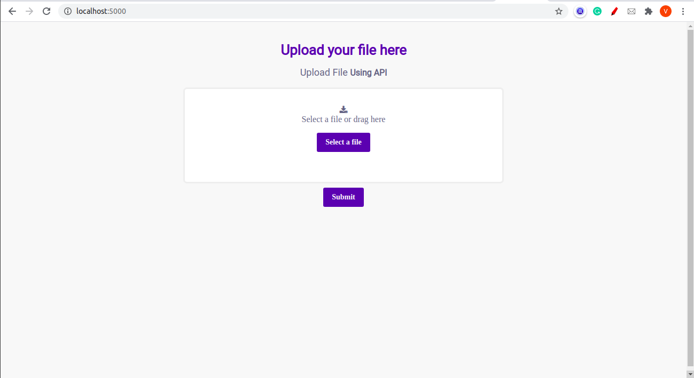

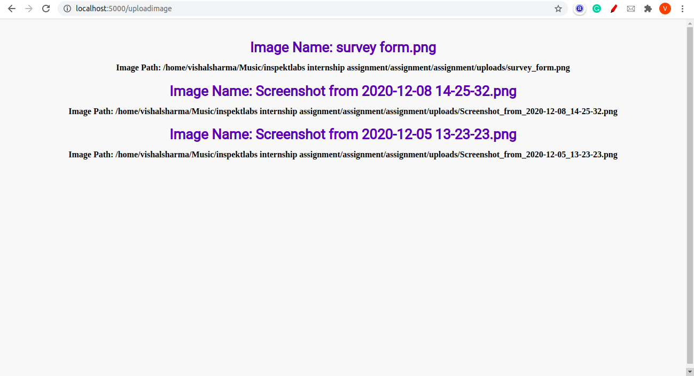

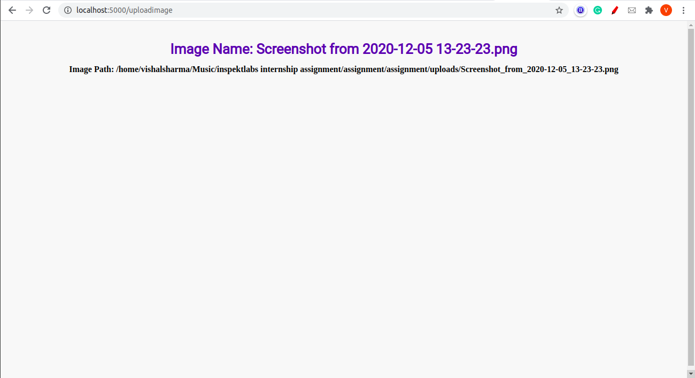

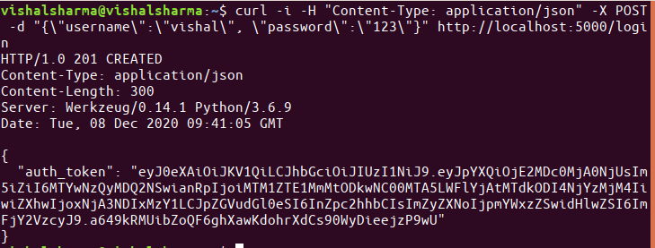

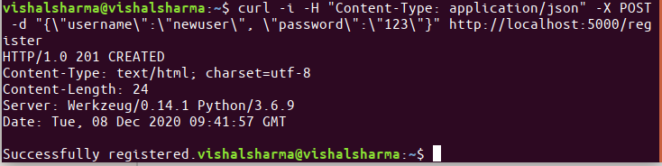

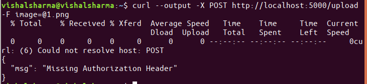

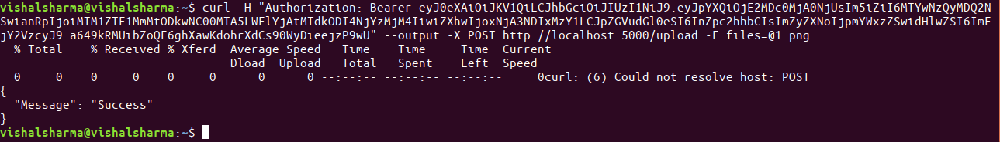

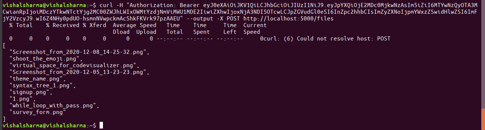

## Test Images for web camera

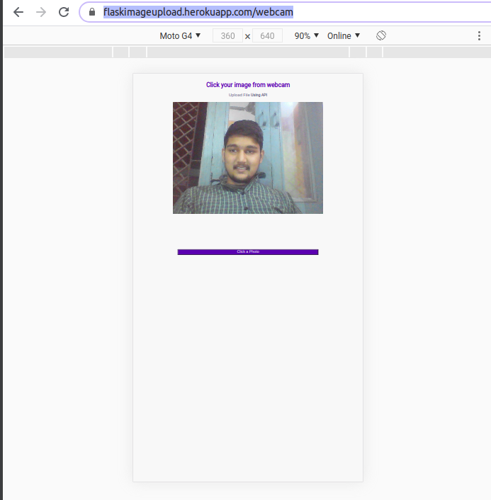

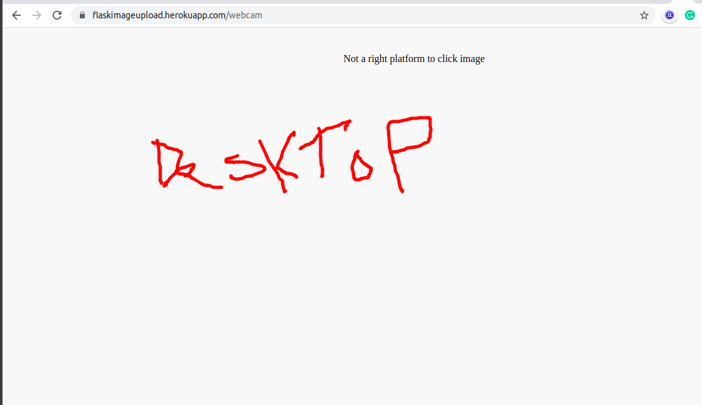

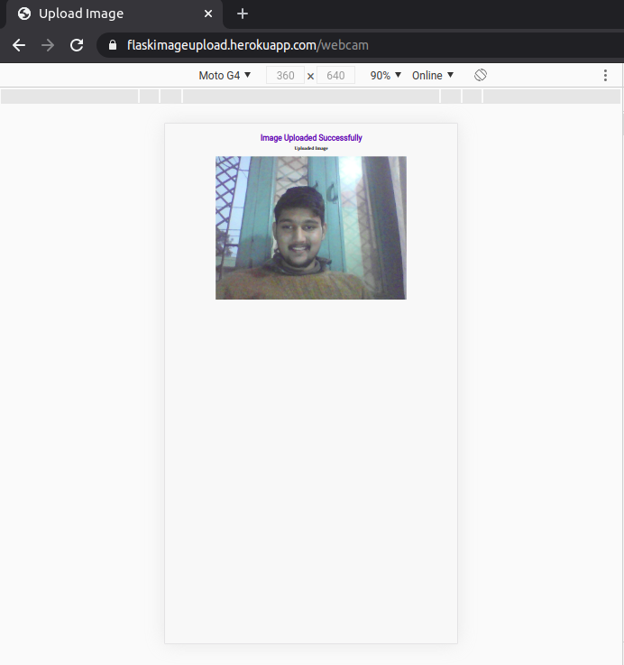


# How to run user.sh and test.sh

Use the following command, but before that replace few of required parameters such as jwt token value.

You need to download the repo on local system to run this project.

```

sh user.sh

sh test.sh

```


# Contact Details

### Name

Vishal Sharma

### Email Address

- vishalsh533@gmail.com
- vishalsharma.gbpecdelhi@gmail.com
